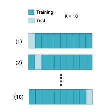

```{r setup, include=FALSE}
knitr::opts_chunk$set(echo = TRUE)
```


## Packages

Load required packages
```{r}

require(titanic)
require(dplyr)
require(ggplot2)
require(rpart)
require(rpart.plot)
require(caret)
require(tidyr)
```


## Data

```{r data}
titanic <- bind_rows(titanic_train, titanic_test)  |> 
  as_tibble()  |>  
  select ( survived = Survived, class = Pclass, sex = Sex, age = Age)  |>  
  mutate(survived = factor(survived, levels = c(0,1) , labels = c('Dead', 'Surv')))  |> 
  na.omit()

trn <- titanic %>% 
  sample_frac(.8)

tst <- titanic  |> 
  anti_join(trn, by = names(trn))

nrow(trn)
nrow(tst)
```

## Blind Classification 

```{r}
tbl <- table(trn$survived)  |> 
  prop.table()  |> 
  round(2)

tbl

cl <- names(tbl)[tbl == max(tbl)]
```


Majority of passengers (`r max(tbl)`) were `r cl`. 


As a consequence, if we were to classify the whole traing data set, without any further information,
the most educated guess for any passenger would be classifying teh passengr as __`r cl`. __

## Training Miss Classification Error 

Prediction:
```{r}
prd <- factor(rep(cl, nrow(trn)), levels = levels(trn$survived))
```

Confusion matrix:

```{r}
cm <- table(trn$survived, prd); cm
```

Training miss classification error (MCE): 

```{r}
mce <-   1 - sum(diag(cm))/sum(cm); mce
```  

## Cross Validation MCE

## Cross validation (xval) {.columns-2}

{width=80%}

Training set is split into 10 subsets

Each subset becomes a validation set with the concatenation of the remaining nine becomong the new training set  

Blind classification is performed on each training set and prediction is made on each validation set 

Prediction is teherefore made on ten validation subsets 

MCE is computed for each validation set for a total of ten MCEs

We then compure average and standard deviation of the ten MCEs


## Test MCE

Prediction:
```{r}
prd <- factor(rep(cl, nrow(tst)), levels = levels(trn$survived))
```

Confusion matrix:

```{r}
cm <- table(tst$survived, prd); cm
```

Test miss classification error (MCE): 

```{r}
mce <-   1 - sum(diag(cm))/sum(cm); mce
```  


## Basic Tree

```{r fm0}
fm0 <- rpart(survived ~ . , data = trn, method = 'class', 
        parms = list(split = 'gini'), 
        control = rpart.control(maxdepth = 1, xval = 10))
```

```{r plot0}
rpart.plot(fm0)
```

## Root node

Root node holds 100% of data (passengers)

```{r}
n_survived <- sum(trn$survived == 'Surv')
n <- length(trn$survived)
```

A proportion of `r round(n_survived/n, 3)` passengers survived


```{r}
n_survived; n
```

```{r}
e0 <- n_survived/n
e0
```

Root node is classified as `Dead` node as the prevalent class is `Dead` 


## Root node

As root node is classified as a `Dead` node. 

Without any further split the miss classification error would be: `r   e0`

Given that we are using variable `sex` as a splitting value, the split tells us that females survived and males died

```{r}
conf1 <- trn  |> 
    group_by(survived, sex)  |> 
    count()  
  conf1
```

Dead female and survived males become miss classifications

## Miss classification

The miss classification error becomes:

```{r}
dead_female <- conf1  |> 
  filter (survived == 'Dead' & sex == 'female')  |>
  pull(n)
surv_male <- conf1  |> 
  filter ( survived == 'Surv' & sex == 'male')  |>
  pull(n)
e1 <- (dead_female + surv_male)/n
e1
```


Miss classification error at split one as proportion of Miss classification error at split zero becomes:

```{r}
e <- e1/e0
e
```

That is, given a simple first split  we reduce the miss classification error from `r e0` to `r e1` 
with a percentage reduction of `r e`


## print cp

Function `printcp()` makes all of this for us

```{r}
printcp(fm0)
```

## Cross validation (xval) {.columns-2}

{width=75%}

For each split 

Training set is split into 10 subset 

Tree is fit on nine out of ten subsets while wth 10~th~ subset is used for prediction

Prediction is made on ten test subsets 

MCE is computed for each test 


## xval explained

```{r}

xval <- function(i , trn){
  val_i <- sample_frac(trn, .1)
  trn_i <- trn  |> suppressMessages(anti_join(val_i))
  fm_i <-  rpart(survived ~ . ,data = trn_i, method = 'class',
                parms = list(split = 'gini'), 
                control = rpart.control(maxdepth = 1, xval = 10))
  prd_i <- predict(fm_i, newdata = val_i, type = "class")
  conf_mat_i <- table(val_i$survived, prd_i)
  err_i <- 1-sum(diag(conf_mat_i))/sum(conf_mat_i)
}
err <- purrr::map_dbl(1:10, xval, trn = trn)
```
```{r}
xerror <- mean(err); xerror
xstd <- sd(err); xstd
```


## Cp


## Fit tree

```{r}
fm1 <- rpart(survived ~ . , data = trn, method = 'class', 
        parms = list(split = 'gini'), 
        control = rpart.control(cp = 0.00000001), xval = 10)
printcp(fm1)
```

##  Plot full tree

```{r}
rpart.plot(fm1)
```

## Cp table

```{r}
cptable1 <- fm1$cptable  |> 
    as_tibble()  |> 
    rename(rel_error = `rel error`)
cptable1
```

## Cp Plot  {.columns-2 .smaller}

```{r} 

bs_data <- cptable1  |> 
    filter(xerror == min(xerror))  |> 
    head(1)  |> 
    mutate(h = xerror+xstd)


cptable_plot <- cptable1  |> 
  filter ( rel_error < 1) 

pl <- ggplot(cptable_plot) + 
  geom_point(aes(nsplit,rel_error)) + 
  geom_line(aes(nsplit, rel_error)) +
  geom_line(aes(nsplit, xerror, color = 'red')) +
  geom_errorbar(aes(x = nsplit, 
                   ymin=xerror-xstd,
                   ymax=xerror+xstd),
                   width=.2,
                   color = 'red') +
geom_point(aes(nsplit, xerror), color = 'red') + 
  geom_point(aes(nsplit, xerror), 
  color = 'darkgreen', 
            data = bs_data, 
            size = 10,
            shape = 17) + 
scale_x_continuous(name ="Number of Splits",breaks=cptable_plot$nsplit,
                  sec.axis = sec_axis( trans=~., name="Cost of Pruning (CP)", breaks=cptable_plot$nsplit, 
                  labels = round(cptable_plot$CP,3))) +
                  theme(legend.position = "none")
print (pl)    
```

## Best Cp

```{r}
best_cp <- cptable1  |> 
mutate( lcl = min(xerror) - xstd,
        ucl = min(xerror) + xstd)  |> 
      filter (xerror >= lcl, xerror <= ucl)  |> 
      filter ( nsplit == min(nsplit)) |> 
      pull(CP)
best_cp
```

## Prune

```{r}
fm2 <- prune(fm1, cp = best_cp)
rpart.plot(fm2)
```


## Summary

```{r}
summary(fm2)
```

## Variabel importance

# ref 
https://stats.stackexchange.com/questions/117908/rpart-complexity-parameter-confusion


I have a purely categorical dataframe from the UCI machine learning database 

https://archive.ics.uci.edu/ml/datasets/Diabetes+130-US+hospitals+for+years+1999-2008


